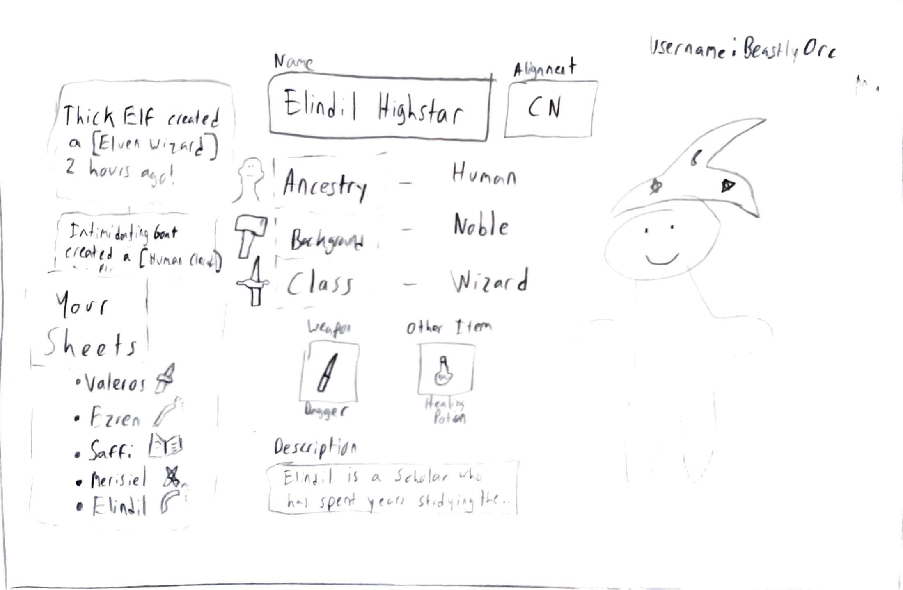

# Character Sheet Maker

## General Description

### Elevator Pitch
People have played roleplaying games like Dungeons and Dragons for almost fifty years now. Livelihoods are built around it, fans watch hours-long streams of their favorite games, and even dress up when they excitedly play in their own games with their friends. Naturally, when these people want to share their characters they spend hours dreaming of and building! This is where the D&D QuickShare app comes in, in minutes, you can quickly make a character and share it with buddies to give them an idea of how your ideas come to together in a super cool concept!

## Design

## Main Features

- Quick, secure HTTPS login with a username and password
- Username always visible on top-right
- Easy-to-navigate UI
- Multiple options for core choices, such as race, background, and class
- Multiple images to represent the character built
- A wide variety of weapons and equipment to use
- Real-time notifications when other users create their own characters
- Links to official printable sheets to create physical character sheets
- A quick tutorial on how to make a character and what each option means
- An overview of TTRPGs and how to play
- Persistent storing of one's sheets on-server

## Technologies

The following technologies will be implemented in the deliverable:

### HTML
- Three HTML pages: login, information about TTRPGs, and general building page
- Clickable and changeable fields for character creation (race, background, class)
- Text boxes to store a character's name and a brief description

### CSS
- Colorful buttons for the changeable fields
- Adjustment for different screen sizes
- Consistent and easy on the eyes color scheme

### JavaScript
- Functionality to change character choices
- Login and password features
- Displaying of character/weapon images/icons, other users' sheets

### Web Services
- Retrieval of other users' character sheets from database
- Username/password services

### Database
- Storing of character sheets for later views and edits

### Authentication
- Required username and password before other services are rendered
- Ability to create a new account with a different username and password

### Web Sockets
- Real time notification when others submit character sheets

## HTML deliverable

Using HTML, I was able to code my web pages to create the basic structure that will support future features.

- **Pages** - Four HTML pages: the homepage, an information page, the character creator itself, and a place to look at other users' characters (structure not complete as of yet).
- **Links** - Links both to outside sources of information (such as a description of TTRPGs) and to other pages within the site using a common directory.
- **Text** - Liberal amounts of text to provide information about Pathfinder and to describe each required input.
- **Images** - Banners present on most pages.
- **Login** - Basic structure for login on homepage.
- **Database** - Forms created that will send data about each character sheet to the server to be stored.
- **WebSocket** - A page entirely dedicated to see other users' character sheets, in real-time (unimplemented as of yet).

## CSS deliverable

Utilizing CSS stylesheets and Bootstrap resources, I was able to style each page to be much more intuitive and visually appealing.

- **Header** - Each HTML page includes a header with the name of the site and an aesthetically pleasing navigation bar to access each page.
- **Main Body** - Each page's main body includes its relevant info (such as character details or TTRPG information) styled to be easy to read. Good contrast and use of colors helps distinguish one element from another.
- **Footer** - Each page also includes a footer with my name and a link to my GitHub repository (which you have already noticed).
- **Responsiveness** - Each page automatically removes its footer if the view height is too large. Prominent details on each page also dynamically resize when the view is changed.
- **Elements** - Each page has a designated purpose with unique elements and appropriate placeholders for future content. 
- **Content** - Text and image content is present throughout all pages.

## JavaScript deliverable

Implementation of JavaScript allowed me to introduce key elements that allow the webpage to react to user choices.

- **Local Storage** - The home page allows the user to input their username into local storage, which is displayed on the main creator page.
- **Ability Score Calculation** - After the user modifies one of their character choices, JavaScript automatically recalculates the totals for each ability score and instantly displays it.
- **Dynamic Images** - Once the user changes their ancestry, the photo representing their character is automatically replaced with an image reflecting their new choice.

## Service deliverable

  Adding an Express service behind the scenes allows my startup to pull data from a central location from any page we're on!

- **Centralized Data** - Maintaining an array of all character sheets in my service lets me pull that information to the community sheets page whenever a button is clicked!

 ## Database deliverable

 Adding MongoDB database functionality allows stored data to persist across server shutdowns and allows for off-site data storage

 - **Persistent Data** - Maintaining an off-site database connected to the website allows data to persist at all times–even when the server isn't running. Data added to the datbase persists even after restarting the server.

## Authentication deliverable

Adding an authentication service allows for users to create and log in to secure account with usernames and passwords they create.   

- **User Information** - The adding of an authetication system allows user information (username and password) to be securely stored in MongoDB for later use.
- **Information Security** - User passwords are salted then hashed ten times over before being added to ensure maximum security.
- **Unique Users** - Before a new user is registered, their username is searched for in the database; the new user request is denied if another user with that name is found, ensuring no two users share the same username.
